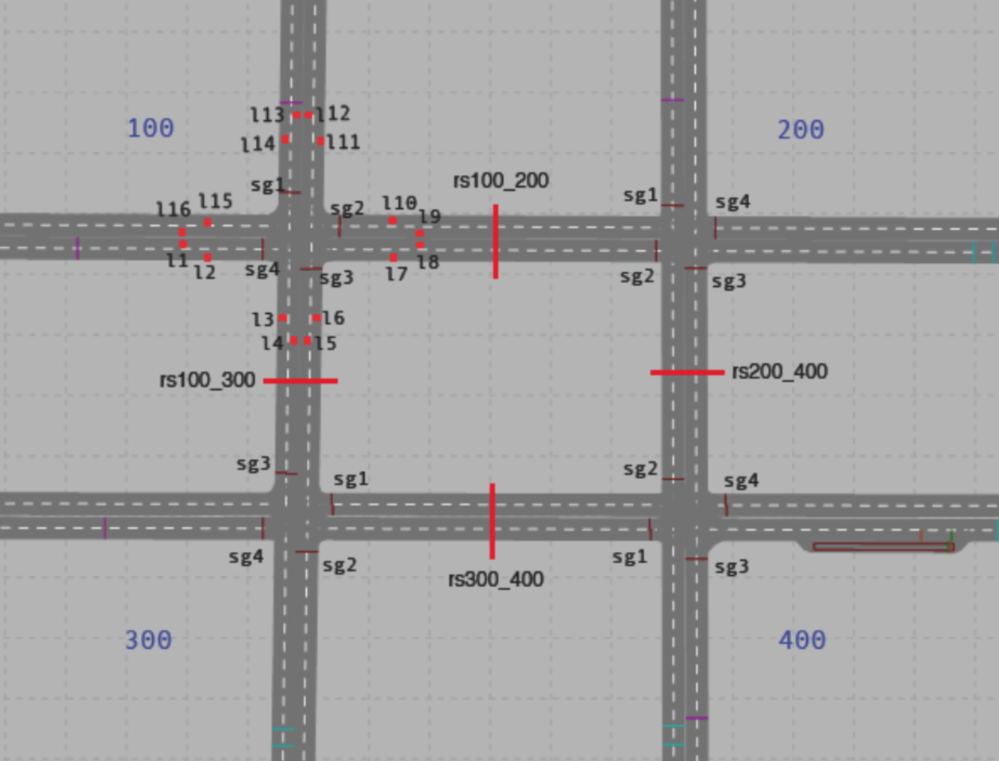
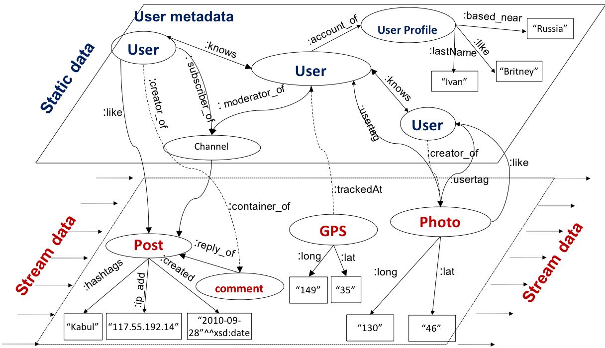

# Stream Reasoning Workshop 2019 - Challenge Track

# Introduction

The idea of the Stream Reasoning Challenge (SRC) originated in a first
session held at the SR Workshop 2018, where several groups worked out a possible
formats for comparing and evaluating stream reasoning/processing 
tools. 

One conclusion, worded by Boris and Jacobo, was that our community misses an unified agreement
on the used formalism, languages, and standards that captures stream
reasoning/processing.
It is too early to conduct a benchmark competition that
compares the performance of existing tool, hence a "model and solve"
competition would be more suitable.
<!-- is not feasible yet. -->

A "model and solve" challenge aims at evaluating the modelling skills
independent of the formalism/language.  For this, we provide the two
given scenario, cooperative intelligence transport systems (C-ITS) and
social media streams with one or more tasks to solve.  At the end of
the challenge, we aim at evaluating the development effort, easyness of
use, and originality of the solutions.

Importantly, the initial plan was to conduct the full SRC at the Stream Reasoning
Workshop 2019. However, due to several open points and time limitation,
we plan to finalize a clear format for challenge, and conduct the
actual SRC on a future date (tbd).


<!--
The different teams can bring their own tools or are encouraged
to apply another preferred tools, which might be from
a different community.

**Important: Please let us know what tool you will provide or would
  like to use, so we can prepare ourselves for it!**
-->


## Programm for April, 16th, 2019

* 09:00 - 09:20   *Danh Le Phuoc*: Welcome and overview
* 09:20 - 09:50   *Jacopo Urbani*: Invited talk
* 09:50 - 10:20   *Patrik Schneider*: Follow up and progress
* 10:20 - 10:40   Q&A with discussion
* 10:40 - 11:00   Coffee break
* 11:00 - 12:00   Brainstorming, finalization, and next steps 

## Programm Details

The first program point will be the keynote of Jacopo Urbani with
the aim of giving an overview on his survey on stream reasoning (1). The second
program point will be a progress report on the challenge, which
includes the outline of two scenarios and possible tasks that could be
solved in it. Further, we will suggest possible rules for the SRC
and the means for its evaluation/scorings, as well as possible
evaluation platforms.  We then will start a hands-on meeting, where we
discuss the above topics. Of interest will be (a) which scenarios
should be used; (b) define the set of task that should be solved; and
(c) agree on a framework on how the model challenge should be
conducted, which includes also the evaluation platform.


<!--
# Important Dates

* 08.04.2019: Team registration
* 14.04.2019: Start of the challenge 
* 17.04.2019: Presentation of results and report
-->


# Problem Description, Scenario, Tasks

As mentioned, the format will be a "model and solve" challenge, where the
modelling skills independent of the formalism/language are
evaluated. We outline the two combined scenarios, introduce the tasks,
and outline the rules.

## Scenarios

**C-ITS.**
This C-ITS scenario is in the area of  cooperative intelligent
transportation systems (C-ITS), where we are able observe and
analyze streams of vehicle movements and traffic light signal phases.
Additionally, we will include unexpected events (triggering by us)
such as vehicle breakdowns.

In this scenario we can group the tasks to be tackled into:

* Gathering traffic statistics, e.g., counting the number of vehicles passing;
* Event detection, e.g. detecting, accidents or traffic jams;
* Diagnosis, e.g., finding the cause for a  traffic jam;
* Motion planning, e.g., routing the vehicles optimally through the network.

The difficulty of this scenarios originates from spatio-temporal
nature of the traffic data, the possible hight velocity and volume,
and as well the rather complex domain model.

**Social Network Stream.**
The Social Network Stream provides social stream data generated by users connected to a social network. 
The stream data is provided by a data generator of [LSBench](https://code.google.com/archive/p/lsbench/) 
that is built on top of [Social Network Benchmark](http://ldbcouncil.org/developer/snb)
of [Linked Data Benchmark Council](http://ldbcouncil.org/). The data generator emulates the data distribution
on social network connections among users, their posted contents and their location data. The detailed of data schema and distributions are described in below. 


**Combined Scenario.**
Both scenario are integrated into a transport social media scenarios,
where the data of two above scenarios are correlated and could be combined.
In particular, users in social network can be pedestrians or owners of the vehicles
or users taking a ride-sharing services. Besides, the events relevant to traffic (e.g.
music events, acidents, etc) can be extracted from messages/posts in a social media
platformt, e.g. twitter.
 The combination allows us to add contextual
information to the vehicle movements and variable locations
to the messages. One task could include to distinguish different
causes for a traffic jam, i.e., the traffic jam could be caused
by external causes, e.g. a concert, or internal causes related
to an overload of the road network. 


## Tasks

Following, we present a list of possible tasks, which can be extended with
user submitted task.

**Task 1 (C-ITS).**
For the C-ITS scenario, we sugguest three successive more difficult tasks, which are
taken from our EKAW 2018 paper (2):

* Calculating the number of vehicles (split by vehicle type) and average speed passing each intersection on our map.

* Detecting a traffic jam on an interesection, which needs to take into account that vehicles also stop (for a limited time) due to red lights.

* Detecting traffic waves, also called phantom traffic jams, where decreas in traffic flow propagates throught the network. Traffic waves can be caused by human behaviour, accidents, artifical obstacles as narrowing of lanes.

**Task 2 (Social Media).**

* Notify if a user has been tagged in a photo (within a day that a friend of his/her has liked
the photo)

* Notify a person that all comments on a post of a channel that he/she is subscribed to have
been liked by one of his/her friends

* Notify a user of all the friends having been tagged in a photo taken close to his current
location within 1 day and the photo has been liked by someone in the last 15 minutes 

* Notify a person tagged in photo of a person that has liked the photo but is not in the person’s
friend list

* Notify a user of all the posts and photos liked by friends of his/her friends

**Task 3 (Combined).**
External causes, e.g. a concert, versus internal causes related
to an overload of the road network...

# Rules and Evaluation

<!-- ## Rules and Evaluation -->

We introduce the following rules (open for discussion):

(1) The organizers select a number of problem tasks, which aree
     selected from the given (see above) and user-submitted tasks. A
     set of test streams for each task is predefined, expressed in
     possible instance input formats Datalog and RDF.

(2) The organizers provide a set of tools (list below), however, users are allow to
   bring their own tools, or even simply use scripts.

(3) For each task, teams are allowed to use a specific solver (or a
solving script) and a problem encoding.

(4) Teams can either be assembled before the conference, or are on-demand
    set-up at the begin of the challenge.

(5) Solutions should be presented at the end of the competition. 

After the solution presentation, a jury selected from the workshop
participant give scores according on the  criteria:

* Development effort,
* Operability and easyness of use,
* Problem coverage,
* Originality of the solutions.

# Data, Platform, Systems


## ITS Data

The provided data is based on a realistic traffic simulation of four
intersections in a #-shaped layout. The scenario environment was
developed with the microscopic traffic simulation *SUMO* or *PTV VISSIM* 
that allows us to simulate realistic driving behavior and signal
phases. The structure of the intersection, driving patterns and signal
phases are fixed, but we have adapted the traffic densities by light,
medium, and heavy traffic.

We extracted the actual state of each simulation step, allowing us to
replay the simulation from the logs.Throughput of the replayed streams
can be increased by replaying the simulation with 5ms, 10ms,
50ms, and 100ms (real-time speed of traffic) delay.

**Static Knowledge:**
As shown in the figure, each intersection connects four roads with two incoming and outgoing lanes for each road.
For the two incoming lane one signal group is assigned.
Further, for each lane we define is geometrical extension (a polygon) and
the connection from in incoming to outgoing lanes. As an example, lane "i100\_l1" in our model is
described in Datalog as:

* ``` intersection(i100). ```
* ``` mapLaneIn(i100_l1). ```
* ``` isPartOf(i100_l8, i100). ```
* ``` hasGeo(i100_l1, "POLY((0 1, 2 1, 2 3, 0 3, 0 1))"). ```
* ``` connected(i100_l1, i100_l3). ```




The four signal groups are managed by one traffic light controller,
which assigns red (stop) and green (go) states to signal phases. The
signal phases for each signal group are encoded in a signal plan,
where the green/red split of a full phase length is defined.

We provide two separate schemas for this, one is the ITS ontology
(http://www.kr.tuwien.ac.at/research/projects/loctrafflog/ekaw2018/)
and the other is simplified version of the ontology encoded in
Datalog. 

**Data Streams:**
The microscopic model of the traffic is represented by four data
streams extracted from simulation in each step.  They include vehicle
speed and position, heading, as well as signal phase states.  each
data point has an vehicle ID $id$ (beside signal group id $group$, and
a time stamp $ts$ assigned:

* ``` speed(id, speed, ts) ```
* ``` pos(id, point(x,y), ts) ```
* ``` heading(id, angle, ts) ```
* ``` signalPhase(group, state, ts) ```

**PS: We could add a weather stream...**

## Social Media Streams

The data in a social network can be divided into two main categories: i) non-timestamped
data (static data) containing the data that is not frequently changed or updated, and ii) streaming data
containing the data that is updated or arrives frequently. Below Figure shows the two data layers that
contain the static data and stream data this scenario can provide.



**Static data:** The upper layer in this Figure, i.e., the non-timestamped data layer  contains user
profile information (name, date of birth, location, relationship status, etc.), the relationships among
users, and the channels in which users write posts, comments, etc. Note that user profile data can be annotated with the ontologies of [LUBM](http://swat.cse.lehigh.edu/projects/lubm/) or [UOBM](https://www.cs.ox.ac.uk/isg/tools/UOBMGenerator/) Benchmark to include OWL reasoning processing load.

**Stream data:** The lower layer , i.e., the stream data layer, contains various sources of
streaming data such as posts and comments, photos, and GPS information.

*GPS stream:* Inspired by the use case in Live Social Semantics, 
we assume that each user has a GPS tracking device for sending updated information
about his/her current location to the social network frequently. Each GPS information contains the
latitude and longitude of a location and a timestamp.

*Posts and comments stream:* There is a large stream of posts and comments in a social network
as users start or join discussions. Similar to the availability of the “wall” for each user in Facebook
or the “Tweet timeline” for each Twitter user, in our generated social network, each user has his/her
own channel for writing posts. The user becomes the moderator and obviously a subscriber of this
channel. People who subscribe to this channel (or “follow” the moderator as in Twitter) can read and reply to the posts and comments created in the channel. Each channel is used for the posting stream of
a user. In this stream, we are particularly interested in the stream of “likes” (i.e., people who show their
interest in a post) , the stream of tags (i.e., the set of words representing the content
of the discussion), and the stream of IP addresses from which people send the post or comment.

**Photo stream:* Uploaded photos and their associated attributes provide a lot of interesting
information for discovering user habits, friend relationships as well as attractive spots, etc. In this
stream data, we focus on exploiting useful information from the stream of user tags (i.e., list of users
who are tagged in a photo), the stream of location information where the photo was taken, the stream
of likes per photo .

To simulate the social network data according to this schema, our LSBench provides a data generator,
called Stream Social Network Data Generator (S2Gen). It generates data in consideration of the
continuous query semantics  and various realistic data distributions, such
as the skewed distributions of posts/comments. As window operators are primitive operators in a continuous query, the correlations among simulated data have an affect on the data windows over
streams. To meet this requirement, S2Gen uses the “window sliding” approach from the structurecorrelated
social graph generator S3G2. As such, to generate the stream data,
S2Gen slides a window of users along all users in the social graph and creates social activities for each
user (writing a post/comment, uploading photos, sending GPS tracking information). For creating a
particular stream data, e.g., the stream of posts and comments, S2Gen extracts all the posts/comments created for all the users, then
sorts them according to their timestamps, and finally serializes these data to a file. A stream player is
created in order to push the stream data from this file into a streaming engine. other streams are created in a similar way.

For the static data, S2Gen generates the user profiles and the friendship information of all the users
in order to form Udata . The details of this step and how to simulate the data correlations in the static
data are the same as in S3G2. Note that all the generated stream data is correlated with non-stream
data, e.g., user tags in the photo stream are correlated with friendship information. Various realistic situations are also simulated while generating stream data, e.g., for GPS stream data, around a specific
time, the latitude and longtitude sent by those people attending the same event are close to each other
and to the event’s location.
To allow a flexible data generation, S2Gen offers a range of parameters. The main parameters used in
the following experiments are:

**Generating period:** The period in which the social activities are generated, e.g., 10 days, or one
month. By varying this parameter, one can create streams with different sizes for testing scalability.

**Maximum number of posts/comments/photos for each user per week:** Each of these parameters
can be adjusted in order to change the amount of data that arrives in a window of time. It thus can
increase/decrease the input rate (e.g., number of triples/seconds) as the stream player pushes the data
according to a window of time. Besides, it also varies the total amount of generated streaming data for
a fixed generating period.

**Correlation probabilities:** There are various parameters for the data correlations between graph data
and the graph structure, e.g., the probability that users will be connected if they are living in the same
area. They can be customised to specify how data is skewed according to each data attribute. The
tested systems need to recognise these correlation properties in order to optimise their query plan.

## Evaluation Platform

**PS: Needs to be clarified**

## Systems

Besides the user-provided system, we already provide a selection of
systems that could be used in the challenge:

* [CQELS](https://github.com/cqels/CQELS-1.x)
* [C-SPARQL](https://github.com/streamreasoning/CSPARQL-engine) or YASPER 
* [Hexlite](https://pypi.org/project/hexlite/)
* [RDFox](https://www.cs.ox.ac.uk/isg/tools/RDFox/)
* [Vlog](https://github.com/jrbn/vlog)


<!--

# Results

**PS: Need to check which each developer, to find out if we are allowed to us the tool**


Will be announced...

-->

# Organization

The co-chairs of the event are:

* Patrik Schneider, TU Wien and Siemens AG, Austria
* Danh Le Phuoc, TU Berlin


Riccardo Tommasini, Politecnico di Milano, helped design the challenge
and supported us with TripleWave and RSPLab.
	
Thanks to the developers, who provided us with tools!


# References

