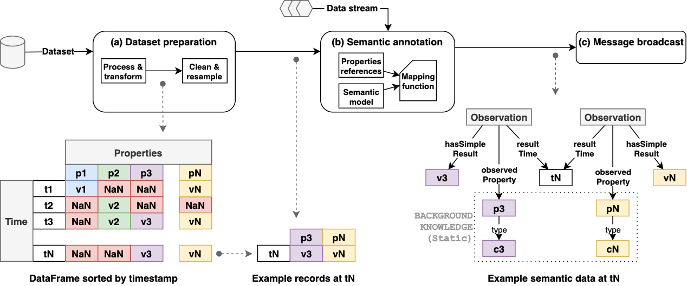

# Streaming out a custom scenario
This folder contains an example on how to reuse the platform of this repository.
The idea is to stream (with semantic data) a custom scenario.
For that purpose, we suggest the following workflow:

To show this, we selected a segment of the [comma2k19 dataset](https://github.com/commaai/comma2k19).
Please, see the notebook named `workflow.ipynb` that explains the corresponding steps.
Additionally, the folder `comma/` contains some files related to the mapping rules written in RML and the resulting RDF data.